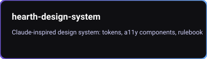

  

  <!-- Typing animation -->
  

  

# Karthick — Full-Stack Developer & AI/Agent Infrastructure Engineer

I build things I can actually check, not things I merely believe work: a chess
engine whose move generator is verified against [perft](https://www.chessprogramming.org/Perft_Results)
counts, a Tic-Tac-Toe AI proven unbeatable by an exhaustive game-tree test, a
15-puzzle generator that only ever emits solvable boards because it accounts
for the parity invariant that makes half of all tile arrangements unreachable.

That same test-first, verify-after habit carries into a newer, larger focus:
tooling that makes LLM and agent systems cheaper to run, easier to debug, and
safer to trust — cost calculators, RAG evaluators, prompt-regression checks,
and agent-transcript forensics, built the same way as the games: with a
documented way to check the claim, not just a README that asserts it.

  
  
  
  
  

---

## What's here

| Pillar | Count | What it is |
|---|---|---|
| [Flagship projects](#flagship-projects) | 5 | The projects I'd point you to first |
| [LLM & agent-ops toolkit](#llm--agent-ops-toolkit) | 24 | Cost, RAG-quality, prompt-testing, and agent-debugging tools |
| [MCP servers](#mcp-servers) | 4 | Small, focused servers for ops/automation and OSS triage |
| [58 Flutter games](#58-flutter-games) | 58 | Classic games, each with a real algorithm underneath, not a stub |

---

## Core strengths

- Test-first development — unit tests, exhaustive/property checks, and reference-verified algorithms (perft, parity invariants) where a simple pass/fail isn't enough
- LLM/agent cost governance: pricing comparison, cache-yield estimation, spend anomaly detection
- RAG pipeline evaluation: retrieval-method benchmarking, groundedness checking, index-staleness monitoring
- Cross-platform app development: Flutter/Dart, Android/Kotlin
- Reproducible builds and releases (Gradle/Android CI, versioned GitHub releases)

---

## Flagship projects

  
  
  
  
  

---

## LLM & agent-ops toolkit

24 small, single-purpose Python tools. Each does one job for LLM/agent systems in production — no dashboards, no SaaS, just a CLI you point at your own logs.

**Cost & pricing**
| Repo | What it does |
|---|---|
| [batch-economics](https://github.com/Karthick-dev-cart/batch-economics) | Real-time vs. batch-API tradeoff calculator — accounts for the latency cost batching hides |
| [cache-yield](https://github.com/Karthick-dev-cart/cache-yield) | Estimates how much prompt caching would've saved, from a historical request log |
| [finetune-vs-prompt](https://github.com/Karthick-dev-cart/finetune-vs-prompt) | Cost breakeven calculator: fine-tuning vs. long-context/RAG prompting |
| [model-arbitrage](https://github.com/Karthick-dev-cart/model-arbitrage) | Cross-provider (Anthropic/OpenAI/Google) pricing comparator for a fixed workload shape |
| [pareto-router](https://github.com/Karthick-dev-cart/pareto-router) | Finds the cost/quality Pareto frontier in a log of real request outcomes |
| [rag-costmap](https://github.com/Karthick-dev-cart/rag-costmap) | Projects RAG indexing, storage, and query costs from 10K to 10M docs |
| [spend-sentinel](https://github.com/Karthick-dev-cart/spend-sentinel) | Statistical anomaly detector for LLM billing/usage logs |
| [tokendiff](https://github.com/Karthick-dev-cart/tokendiff) | CI check that fails the build when a prompt template's token cost regresses |
| [tokenledger](https://github.com/Karthick-dev-cart/tokenledger) | Token cost-attribution ledger for LLM API usage |

**RAG & retrieval quality**
| Repo | What it does |
|---|---|
| [chunk-bench](https://github.com/Karthick-dev-cart/chunk-bench) | Benchmarks document-chunking strategies by their effect on retrieval recall@k |
| [context-packer](https://github.com/Karthick-dev-cart/context-packer) | Picks the max-relevance subset of retrieved chunks that fits a token budget |
| [groundcheck](https://github.com/Karthick-dev-cart/groundcheck) | Sentence-level groundedness/hallucination checker against retrieved context |
| [index-decay](https://github.com/Karthick-dev-cart/index-decay) | Staleness/drift monitor for RAG vector indexes via content-hashed manifests |
| [query-rewriter-bench](https://github.com/Karthick-dev-cart/query-rewriter-bench) | Benchmark harness for RAG query-rewriting strategies |
| [retrieval-arena](https://github.com/Karthick-dev-cart/retrieval-arena) | Compares sparse (BM25), dense, and hybrid retrieval on the same corpus and eval set |

**Prompt & guardrail testing**
| Repo | What it does |
|---|---|
| [guardrail-bench](https://github.com/Karthick-dev-cart/guardrail-bench) | Adversarial red-team harness scoring a system prompt's guardrails via an LLM judge |
| [prompt-regress](https://github.com/Karthick-dev-cart/prompt-regress) | Behavioral regression testing for prompt templates — catches semantic drift and format breaks |
| [rubric](https://github.com/Karthick-dev-cart/rubric) | LLM-as-judge eval harness — rubric criteria in, structured pass/fail report out |
| [tool-contract](https://github.com/Karthick-dev-cart/tool-contract) | Static schema-drift detector for MCP/Claude tool JSON Schema definitions |

**Agent observability & debugging**
| Repo | What it does |
|---|---|
| [agent-graph](https://github.com/Karthick-dev-cart/agent-graph) | Reconstructs a multi-agent call tree from a transcript and shows where tokens/cost went |
| [session-replay](https://github.com/Karthick-dev-cart/session-replay) | Deterministic offline replay/debugger for agent transcripts — diffs two runs to find where they diverged |
| [waypoint](https://github.com/Karthick-dev-cart/waypoint) | Durable, checkpointed workflow engine for chained agent steps, with human-approval gates |
| [workflow-profiler](https://github.com/Karthick-dev-cart/workflow-profiler) | Per-step flame-graph profiler for agent workflow time and token cost |

**Other**
| Repo | What it does |
|---|---|
| [flowforge](https://github.com/Karthick-dev-cart/flowforge) | Config-driven, pluggable streaming ETL pipeline toolkit for Python |

---

## MCP servers

| Repo | What it does |
|---|---|
| [triagekit-mcp](https://github.com/Karthick-dev-cart/triagekit-mcp) | TriageKit — a suite of small, focused MCP servers for automation engineers |
| [pipeline-doctor](https://github.com/Karthick-dev-cart/pipeline-doctor) | Diagnoses Airflow/dbt run failures, traces lineage impact, catches upstream-caused false alarms |
| [k8s-triage](https://github.com/Karthick-dev-cart/k8s-triage) | Diagnoses unhealthy Kubernetes workloads and finds right-sizing candidates from live cluster state |
| [oss-scout](https://github.com/Karthick-dev-cart/oss-scout) | Finds genuinely-contributable open source issues — the unclaimed kind, not the ones under six duplicate PRs |

---

## 58 Flutter games

Each one is a full implementation with a real algorithm behind it, not a
tutorial stub — a representative sample:

| Game | What makes it real |
|---|---|
| [chess](https://github.com/Karthick-dev-cart/chess) | Move generator verified with perft against chessprogramming.org reference values |
| [tictactoe](https://github.com/Karthick-dev-cart/tictactoe) | Minimax AI verified unbeatable by an exhaustive never-loses test |
| [gomoku](https://github.com/Karthick-dev-cart/gomoku) | Alpha-beta minimax with an open-run-weighted threat-scoring heuristic |
| [lightcycles](https://github.com/Karthick-dev-cart/lightcycles) | AI opponent flood-fills reachable space each tick — a real Tron-bot technique |
| [fifteenpuzzle](https://github.com/Karthick-dev-cart/fifteenpuzzle) | Generated boards obey the parity invariant, verified against the historic unsolvable 14-15 swap |
| [freecell](https://github.com/Karthick-dev-cart/freecell) | The actual ruleset — single-card moves aren't a simplification, that's how Freecell works |
| [pixelchase](https://github.com/Karthick-dev-cart/pixelchase) | Pac-Man-style ghosts recompute a BFS shortest path every tick, then flee once you're powered up |
| [tetris](https://github.com/Karthick-dev-cart/tetris) | 7-bag randomizer; tetromino rotations derived by rotating a matrix, not hand-copied tables |

[See all 58 →](https://github.com/Karthick-dev-cart?tab=repositories&q=Flutter)

---

  <!-- GitHub stats (server-generated SVGs) -->
  
  

  

---

## Get in touch

Open an issue on any repo to start a conversation — label it "collab". If you prefer private contact, tell me which contact method to include.

  

