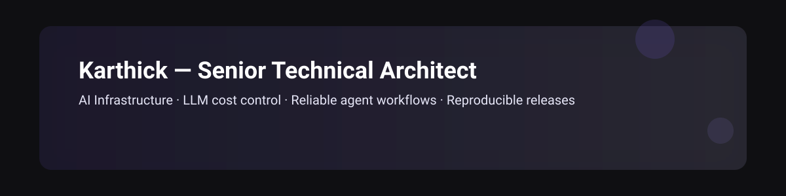
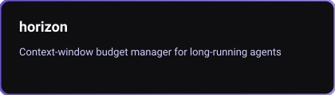
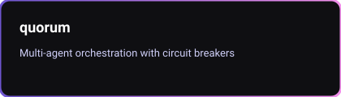
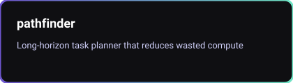

  

  <!-- Typing animation -->
  

  

# Karthick — Senior Technical Architect & AI Infrastructure Engineer

I design and ship production-grade systems that are reliable, observable, and cost-effective. My work spans backend data pipelines, LLM/agent infrastructure, resilient RAG pipelines, and accessible TypeScript frontends — all backed by test-first development, reproducible CI/CD, and verified releases.

  
  
  
  

---

## Animated highlights

- Animated typing headline (above) to give an immediate visual hook.
- Contribution snake shows activity with a subtle animation.
- Polished cards and badges for quick scannability.

---

## Core strengths

- System design for reliability and failure isolation
- Cost-aware LLM operations and spend governance
- Deterministic testing: unit → integration → system
- Reproducible releases and post-release verification
- Developer experience: design systems and automation

---

## Featured projects

  
  
  

---

## Visual & animated assets included

- Typing headline: dynamic text using readme-typing-svg
- Contribution snake: animated SVG from /output (already in repo)
- Hero capsule header: capsule-render SVG banner
- Animated SVG project cards committed to /assets/cards

  <!-- GitHub stats (server-generated SVGs) -->
  
  

---

## Get in touch

Open an issue on any repo to start a conversation — label it "collab". If you prefer private contact, tell me which contact method to include.

  

